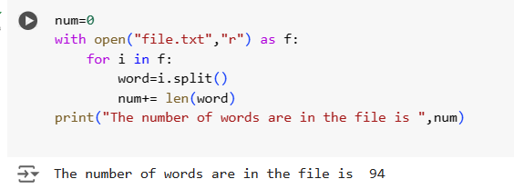

# Word-Count
## AIM:
To write a python program for getting the word count from a text.
## EQUIPEMENT'S REQUIRED: 
PC
Anaconda - Python 3.7
## ALGORITHM: 
### Step 1:
declare a variable and assign zero to it
### Step 2: 
Now open the text file with open() function
### Step 3: 
By using for loop access the file 
### Step 4:  
within the for loop use split() function to split the words
### Step 5: 
Now add the len of the word to the declared variable
### Step 6: 
print the output
## PROGRAM:
```
num=0
with open("file.txt","r") as f:
    for in in f:
        word=i.split()
        num+= len(word)
print("The number of words are in the file is ",num)
```
### OUTPUT:



## RESULT:
Thus the program is written to find the word count from a text.
